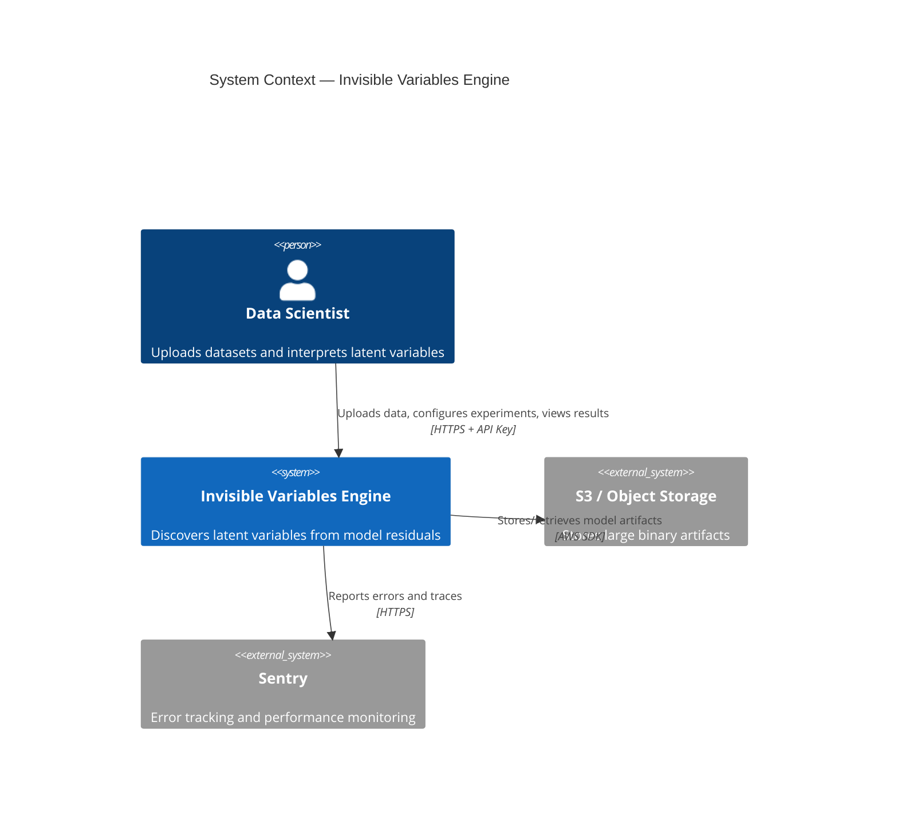
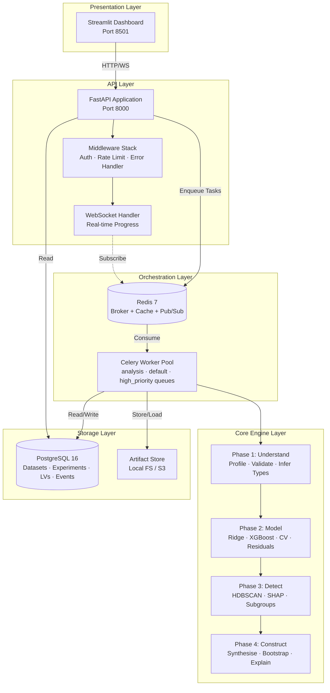
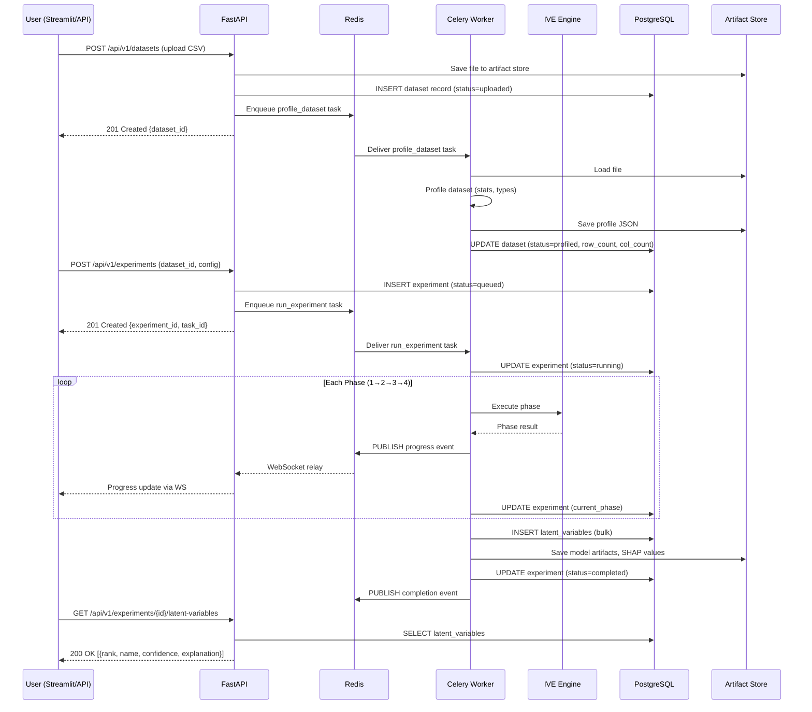
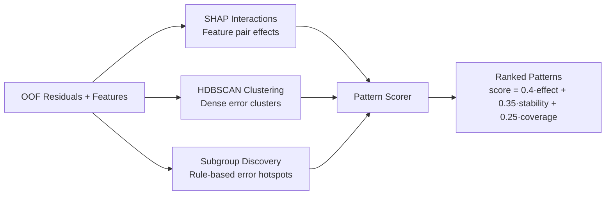
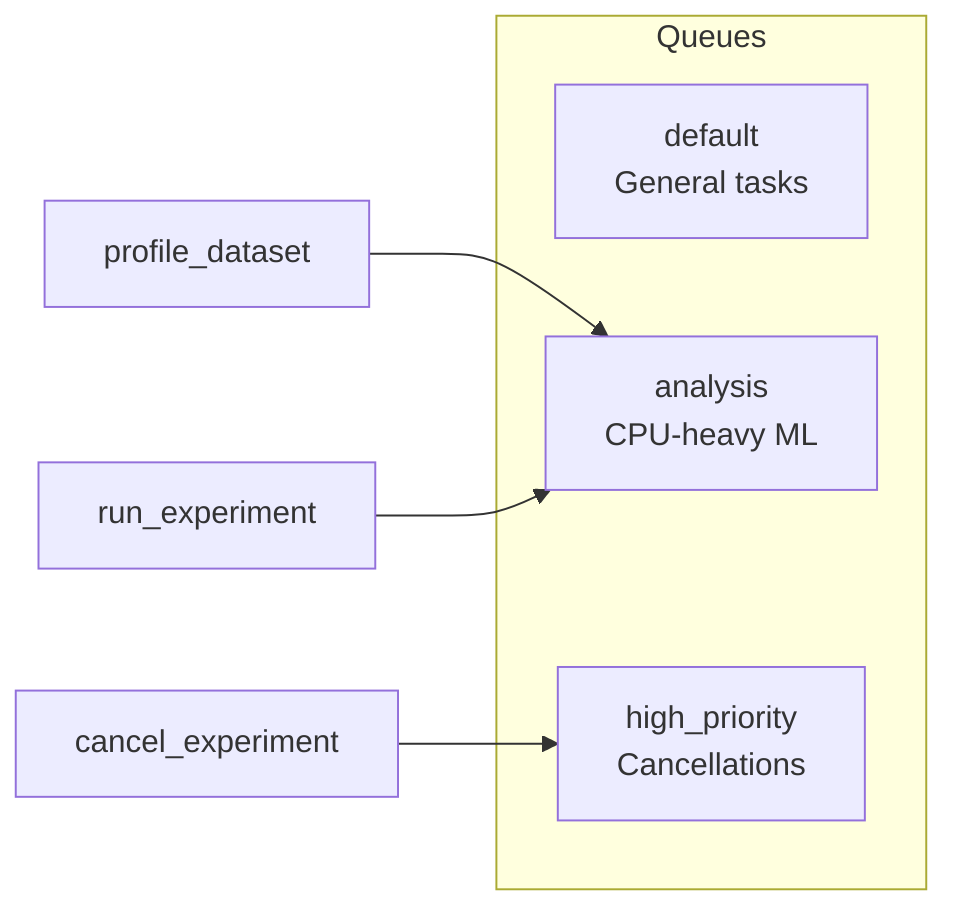
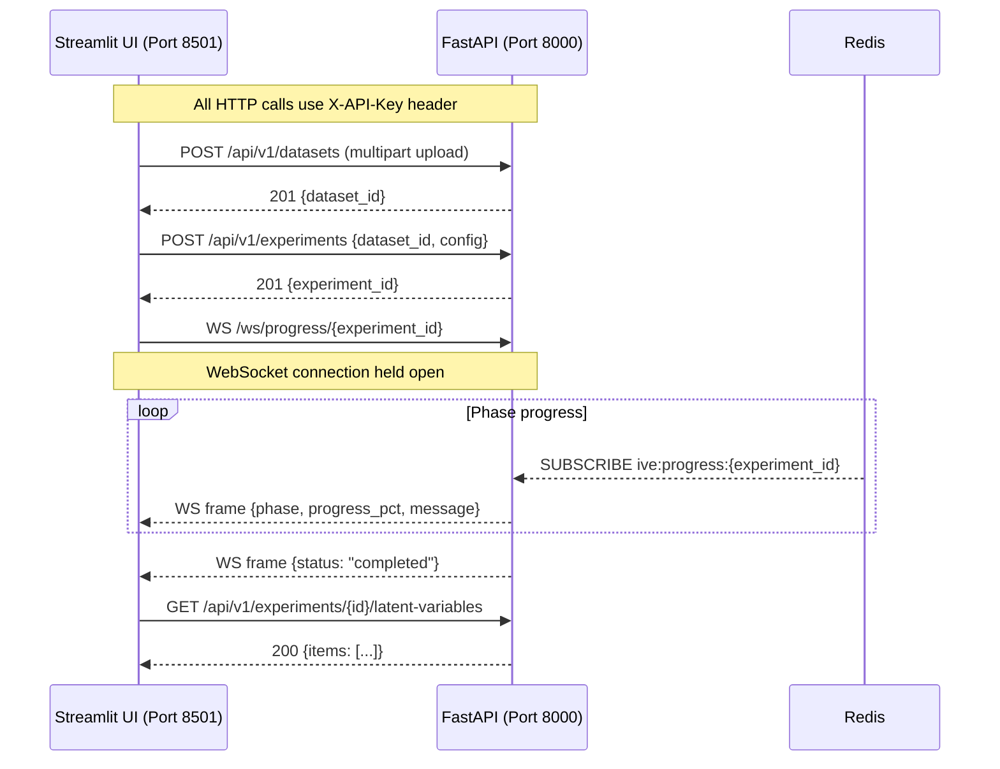
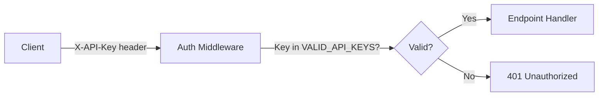
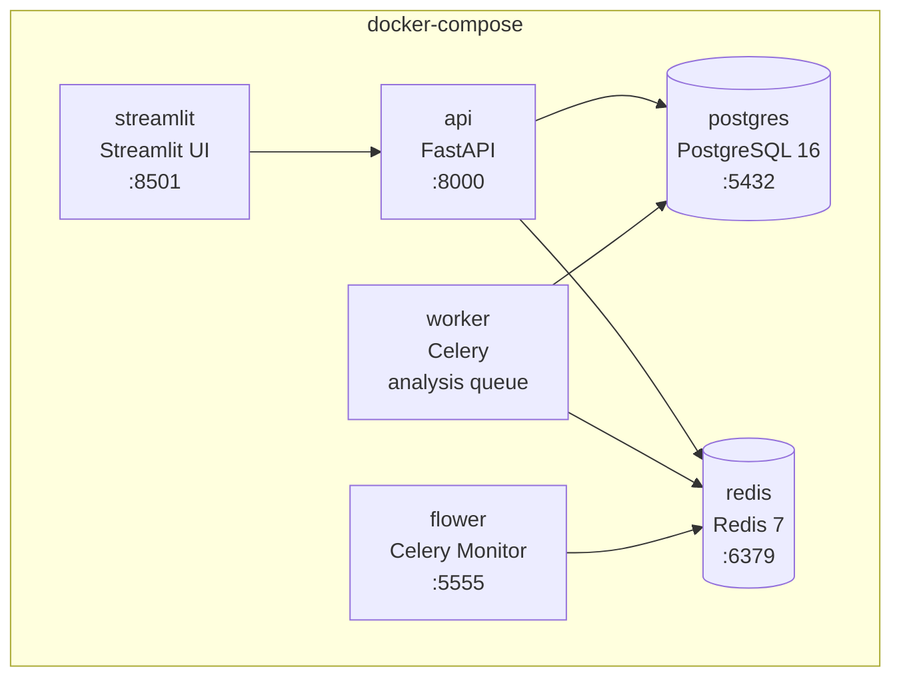

# High-Level Design — Invisible Variables Engine (IVE)

| Field         | Value                  |
| ------------- | ---------------------- |
| **Version**   | 2.0                    |
| **Authors**   | IVE Architecture Team  |
| **Date**      | 2026-03-02             |
| **Status**    | Approved               |
| **Reviewers** | Technical Review Board |

---

## Table of Contents

1. [System Overview](#1-system-overview)
2. [Architecture Overview](#2-architecture-overview)
3. [Component Design](#3-component-design)
4. [Data Flow Architecture](#4-data-flow-architecture)
5. [Integration Architecture](#5-integration-architecture)
6. [Security Architecture](#6-security-architecture)
7. [Deployment Architecture](#7-deployment-architecture)
8. [Scalability Considerations](#8-scalability-considerations)
9. [Technology Justification](#9-technology-justification)
10. [Non-Functional Requirements](#10-non-functional-requirements)

---

## 1. System Overview

### 1.1 Purpose and Scope

The **Invisible Variables Engine (IVE)** is a data science platform that discovers **hidden latent variables** in datasets by analysing systematic model prediction errors.

Most ML models are evaluated on aggregate metrics (R², RMSE). IVE goes deeper — it asks **"where does the model fail, and why?"** By clustering and analysing the structure of cross-validated residuals, IVE identifies subgroups of observations where error is systematically higher than expected, then synthesises candidate **latent variables** that, if measured, would improve model accuracy.

**What IVE does:**

- Accepts CSV/Parquet datasets with a designated target column
- Trains baseline ML models (Ridge + XGBoost) via K-fold cross-validation
- Extracts out-of-fold residuals and analyses them for hidden structure
- Discovers error clusters via HDBSCAN + subgroup discovery + SHAP interactions
- Synthesises latent variable candidates with bootstrap stability validation
- Produces human-readable explanations of each discovered variable
- Exposes a REST API and a Streamlit dashboard for interactive use

**What IVE does NOT do:**

- Automated feature engineering or model tuning
- Unsupervised clustering of the original dataset (clustering is on the residual space)
- Causal inference (IVE provides plausibility checks, not formal causal proofs)
- Deep learning model support (limited to tabular models)
- Real-time or streaming data processing

### 1.2 Key Stakeholders and Users

| Stakeholder          | Role                                                            |
| -------------------- | --------------------------------------------------------------- |
| **Data Scientists**  | Primary users — upload data, run experiments, interpret results |
| **ML Engineers**     | Integrate IVE into existing ML pipelines via the REST API       |
| **Product Managers** | Use Streamlit UI to understand model blind spots                |
| **Platform Team**    | Deploy, monitor, and scale the IVE infrastructure               |

### 1.3 System Boundaries



---

## 2. Architecture Overview

### 2.1 Layered Architecture

IVE follows a strict **five-layer architecture** where each layer only depends on the layer directly below it. Cross-layer dependencies are forbidden.



### 2.2 Component Interaction Diagram



### 2.3 Data Flow Overview

```
CSV/Parquet Upload
    │
    ▼
┌─────────────────┐
│   Ingestion     │──→ Artifact Store (raw file)
│   & Profiling   │──→ PostgreSQL (dataset metadata)
└────────┬────────┘
         │
         ▼
┌─────────────────┐
│  Preprocessing  │   Encode categoricals, scale numerics,
│  & Validation   │   impute missing values, extract dates
└────────┬────────┘
         │  Feature matrix X, target y
         ▼
┌─────────────────┐
│  Cross-Validated│   Ridge + XGBoost × K folds
│  Model Training │──→ Artifact Store (fitted models)
└────────┬────────┘
         │  Out-of-fold residuals r = y − ŷ
         ▼
┌─────────────────┐
│  Detection      │   HDBSCAN(r, X), SHAP interactions,
│  Engine         │   beam-search subgroup discovery
└────────┬────────┘
         │  Ranked patterns with sample masks
         ▼
┌─────────────────┐
│  Construction & │   Synthesise LV candidates,
│  Validation     │   bootstrap 1000×, causal checks
└────────┬────────┘
         │  Validated LatentVariableCandidates
         ▼
┌─────────────────┐
│  Explanation    │   Template-based NL descriptions
│  Generator      │──→ PostgreSQL (latent_variables table)
└─────────────────┘
         │
         ▼
   Streamlit UI / REST API (results)
```

---

## 3. Component Design

### 3a. Data Ingestion & Profiling Service

| Aspect             | Detail                                                                                                                           |
| ------------------ | -------------------------------------------------------------------------------------------------------------------------------- |
| **Responsibility** | Load CSV/Parquet files, infer column types, compute univariate statistics, detect missing patterns, calculate correlation matrix |
| **Inputs**         | Raw file path (CSV or Parquet)                                                                                                   |
| **Outputs**        | Pandas DataFrame, column type map, serialisable profile dict                                                                     |
| **Dependencies**   | Pandas, Polars (for large files), SciPy                                                                                          |
| **Key files**      | `data/ingestion.py`, `data/profiler.py`, `data/validator.py`                                                                     |

**Key Design Decisions:**

1. **Polars for large files, Pandas for API consistency** — Polars can load multi-GB CSVs in seconds via lazy evaluation. The output is always converted to a Pandas DataFrame for downstream sklearn compatibility.
2. **Schema validation is fail-fast** — If the target column is missing or the dataset has fewer than 50 rows, the pipeline raises a `ValueError` immediately rather than proceeding to waste compute.
3. **Column type inference uses heuristics, not dtype alone** — An integer column with 3 unique values is classified as `categorical`, not `continuous`. This avoids building 1000 one-hot columns from a zip code field.

---

### 3b. Model Training Service (Linear, XGBoost, Cross-Validation)

| Aspect             | Detail                                                                                  |
| ------------------ | --------------------------------------------------------------------------------------- |
| **Responsibility** | Train baseline models via K-fold CV, extract out-of-fold predictions, compute residuals |
| **Inputs**         | Preprocessed feature matrix `X`, target array `y`, `ExperimentConfig`                   |
| **Outputs**        | OOF predictions, OOF residuals, fitted model objects, feature importance dicts          |
| **Dependencies**   | scikit-learn (Ridge), XGBoost, SHAP                                                     |
| **Key files**      | `models/linear_model.py`, `models/xgboost_model.py`, `models/cross_validator.py`        |

**Key Design Decisions:**

1. **Out-of-fold (OOF) residuals, not in-sample** — In-sample residuals reflect overfitting, not true generalisation error. OOF residuals are unbiased, making patterns found in them genuinely meaningful.
2. **Both linear and non-linear models** — Linear model residuals capture non-linear effects the model cannot represent. XGBoost residuals capture subtler interaction effects that even gradient boosting misses. Using both provides complementary signal.
3. **IVEModel abstract base class** — All models implement `fit()`, `predict()`, `get_feature_importance()`, `get_shap_values()`. This allows adding new model types (e.g., ElasticNet, CatBoost) by implementing one interface.
4. **Deep copy per fold** — The `CrossValidator` deep-copies the model object for each fold to ensure no state leakage between folds.

---

### 3c. Residual Analysis Service

| Aspect             | Detail                                                                                                                     |
| ------------------ | -------------------------------------------------------------------------------------------------------------------------- |
| **Responsibility** | Characterise the statistical properties of residuals: normality, heteroscedasticity, autocorrelation                       |
| **Inputs**         | Residual array `r`, optional feature matrix `X`                                                                            |
| **Outputs**        | `ResidualAnalysis` dataclass with skewness, kurtosis, Breusch-Pagan p-value, Shapiro-Wilk p-value, Durbin-Watson statistic |
| **Dependencies**   | SciPy, Statsmodels                                                                                                         |
| **Key files**      | `models/residual_analyzer.py`                                                                                              |

**Key Design Decisions:**

1. **Residuals are the primary signal** — The entire detection layer operates on residuals, not raw predictions. This ensures we're finding what the model _doesn't know_, not what it already knows.
2. **Heteroscedasticity is a strong latent variable signal** — If Breusch-Pagan p < 0.05, it means residual variance is not constant, strongly suggesting a missing stratification variable.
3. **Large-residual percentage** — Reporting what fraction of |r| > 2σ gives an interpretable upper bound on how much data is affected by the latent variable.

---

### 3d. Detection Engine

| Aspect             | Detail                                                                                                                                                          |
| ------------------ | --------------------------------------------------------------------------------------------------------------------------------------------------------------- |
| **Responsibility** | Discover patterns in the residual space that suggest systematic model errors                                                                                    |
| **Inputs**         | OOF residuals, preprocessed feature matrix, fitted models                                                                                                       |
| **Outputs**        | Ranked list of `ScoredPattern` objects with sample masks and quality metrics                                                                                    |
| **Dependencies**   | HDBSCAN, SHAP, SciPy, NumPy                                                                                                                                     |
| **Key files**      | `detection/clustering.py`, `detection/shap_interactions.py`, `detection/subgroup_discovery.py`, `detection/pattern_scorer.py`, `detection/temporal_analysis.py` |

The detection engine runs **three complementary strategies** in parallel:



**Key Design Decisions:**

1. **Three strategies, not one** — Each catches different patterns. HDBSCAN catches non-convex clusters. Beam-search subgroup discovery catches interpretable rules. SHAP interactions catch feature-pair effects. The union is much more powerful than any single method.
2. **Residual weighting in HDBSCAN** — When building the joint residual-feature space for clustering, residuals are up-weighted by 2× to ensure clusters are driven by error structure, not just feature similarity.
3. **WRAcc quality metric for subgroups** — Weighted Relative Accuracy (WRAcc) penalises small subgroups by multiplying effect by coverage. This prevents the algorithm from finding tiny, high-error pockets that are statistically meaningless.
4. **Minimum coverage threshold (3%)** — Patterns affecting less than 3% of the dataset are filtered out regardless of their effect size. Small subgroups are prone to being statistical noise.

---

### 3e. Construction & Validation Engine

| Aspect             | Detail                                                                                                          |
| ------------------ | --------------------------------------------------------------------------------------------------------------- |
| **Responsibility** | Convert detected patterns into latent variable candidates, validate their stability, and rank them              |
| **Inputs**         | `ScoredPattern` objects, residuals, feature matrix, target array                                                |
| **Outputs**        | Ranked list of `LatentVariableCandidate` objects with bootstrap stability scores                                |
| **Dependencies**   | NumPy, SciPy                                                                                                    |
| **Key files**      | `construction/variable_synthesizer.py`, `construction/bootstrap_validator.py`, `construction/causal_checker.py` |

**Key Design Decisions:**

1. **Bootstrap validation with 1000 iterations** — Every candidate LV is resampled 1000 times. If the 95% CI for effect size contains zero, the candidate is marked as unstable. This is the primary guard against false positives.
2. **Causal plausibility checks** — Two heuristic filters:
   - _Reverse causality_: if a candidate feature correlates > 0.9 with the target, it may be an effect rather than a cause → flag
   - _Confounding proxy_: if a candidate feature correlates > 0.95 with an already-included feature → flag
3. **Composite scoring formula**: `score = 0.40 × effect_size + 0.35 × bootstrap_stability + 0.25 × coverage`. This balances strength, reliability, and generality.
4. **Jaccard de-duplication** — Patterns with > 90% sample overlap are merged to avoid reporting the same latent variable multiple times.

---

### 3f. Explanation Generator

| Aspect             | Detail                                                                    |
| ------------------ | ------------------------------------------------------------------------- |
| **Responsibility** | Produce human-readable NL explanations for each latent variable candidate |
| **Inputs**         | `LatentVariableCandidate`, dataset profile dict                           |
| **Outputs**        | Multi-sentence explanation string                                         |
| **Key files**      | `construction/explanation_generator.py`                                   |

**Key Design Decisions:**

1. **Template-based generation** — Uses Python f-string templates with slots for effect direction, subgroup description, correlated features, and statistical evidence. This ensures consistency and avoids hallucination.
2. **LLM extension hook** — The class is designed for optional LLM paraphrasing (POST template output to GPT-4 for natural-sounding prose), but the template output is always the fallback.
3. **Auto-generated names** — Candidate names are derived from their top correlated features (e.g., "Latent Zip Code / Commute Time Factor") until a user provides a better label.

---

### 3g. API Gateway

| Aspect             | Detail                                                                   |
| ------------------ | ------------------------------------------------------------------------ |
| **Responsibility** | Expose REST + WebSocket endpoints, authenticate requests, validate input |
| **Inputs**         | HTTP requests from Streamlit or external consumers                       |
| **Outputs**        | JSON responses, WebSocket events                                         |
| **Key files**      | `main.py`, `api/v1/router.py`, `api/v1/endpoints/*`, `api/middleware/*`  |

**Key endpoints:**

| Method   | Path                                        | Purpose                             |
| -------- | ------------------------------------------- | ----------------------------------- |
| `POST`   | `/api/v1/datasets`                          | Upload CSV/Parquet                  |
| `GET`    | `/api/v1/datasets`                          | List datasets                       |
| `POST`   | `/api/v1/experiments`                       | Create and queue experiment         |
| `GET`    | `/api/v1/experiments/{id}`                  | Get experiment status               |
| `GET`    | `/api/v1/experiments/{id}/latent-variables` | Get results                         |
| `DELETE` | `/api/v1/experiments/{id}`                  | Cancel experiment                   |
| `WS`     | `/ws/progress/{experiment_id}`              | Real-time progress                  |
| `GET`    | `/api/v1/health`                            | Liveness probe                      |
| `GET`    | `/api/v1/health/ready`                      | Readiness probe (checks DB + Redis) |

**Key Design Decisions:**

1. **API versioning via URL prefix `/api/v1/`** — Allows deploying breaking API changes under `/api/v2/` without disrupting existing consumers.
2. **Async handlers everywhere** — All endpoints use `async def` and `asyncpg` so I/O operations don't block the event loop.
3. **Pydantic schemas for all request/response bodies** — Provides type-safe validation, auto-generated OpenAPI docs, and serialisation for free.

---

### 3h. Job Queue & Worker System

| Aspect             | Detail                                                                   |
| ------------------ | ------------------------------------------------------------------------ |
| **Responsibility** | Decouple long-running ML computation from the API request/response cycle |
| **Inputs**         | Task messages from Redis broker                                          |
| **Outputs**        | Updated DB records, stored artifacts, progress events                    |
| **Key files**      | `workers/celery_app.py`, `workers/tasks.py`                              |

**Three-queue routing strategy:**



**Key Design Decisions:**

1. **`task_acks_late=True`** — Tasks are acknowledged only after completion. If a worker crashes mid-task, the task is redelivered automatically.
2. **`worker_prefetch_multiplier=1`** — Each worker takes one task at a time. ML workloads are CPU-bound and benefit from exclusive access to compute.
3. **Idempotent tasks** — `run_experiment` can be safely retried because it overwrites existing latent variable records for the same experiment_id.
4. **Separate cancellation queue** — `cancel_experiment` goes to `high_priority` so that a stop signal is processed even when the `analysis` queue is saturated.

---

### 3i. Storage & Artifact Manager

| Aspect             | Detail                                                                            |
| ------------------ | --------------------------------------------------------------------------------- |
| **Responsibility** | Persist and retrieve binary artifacts (models, SHAP matrices, residuals, reports) |
| **Inputs**         | Bytes, JSON, NumPy arrays, or Python objects                                      |
| **Outputs**        | Same, loaded from storage                                                         |
| **Key files**      | `storage/artifact_store.py`                                                       |

**Key Design Decisions:**

1. **Abstract `ArtifactStore` interface** — `save_bytes` / `load_bytes` / `exists` / `delete`. Concrete implementations: `LocalArtifactStore` (development) and `S3ArtifactStore` (production).
2. **Convenience methods** — `save_json()`, `save_numpy()`, `save_pickle()` wrap the raw bytes interface with format-specific serialisation.
3. **Key-based addressing** — Artifacts are stored under structured keys like `experiments/{exp_id}/models/xgboost_fold_0.pkl`, making them easy to locate and clean up.

---

## 4. Data Flow Architecture

### 4.1 What Gets Stored Where

| Data Type                  | Storage                                   | Format       | Lifecycle                 |
| -------------------------- | ----------------------------------------- | ------------ | ------------------------- |
| Raw uploaded file          | Artifact Store                            | CSV/Parquet  | Permanent                 |
| Dataset metadata           | PostgreSQL `datasets`                     | Row          | Permanent                 |
| Dataset profile            | Artifact Store                            | JSON         | Permanent                 |
| Experiment config + status | PostgreSQL `experiments`                  | Row + JSONB  | Permanent                 |
| Fitted model objects       | Artifact Store                            | Pickle       | Tied to experiment        |
| SHAP value matrices        | Artifact Store                            | NumPy `.npy` | Tied to experiment        |
| OOF residuals              | Artifact Store                            | NumPy `.npy` | Tied to experiment        |
| Latent variable candidates | PostgreSQL `latent_variables`             | Rows + JSONB | Tied to experiment        |
| Explanations               | PostgreSQL `latent_variables.explanation` | Text         | Tied to experiment        |
| Phase progress events      | Redis Pub/Sub                             | JSON         | Ephemeral (not persisted) |
| Rate limit counters        | Redis                                     | Key-value    | TTL-based (1 min)         |
| Celery task results        | Redis                                     | JSON         | TTL 24 hours              |

### 4.2 Caching Strategy

| Cache Layer | What                                               | TTL                     | Eviction   |
| ----------- | -------------------------------------------------- | ----------------------- | ---------- |
| Redis       | Celery task results                                | 24h                     | Automatic  |
| Redis       | Rate limit windows                                 | 60s                     | Automatic  |
| Redis       | Health check status                                | 30s                     | Automatic  |
| Application | `get_settings()` via `@lru_cache`                  | Process lifetime        | Never      |
| Application | Dataset profile (read-through from artifact store) | None — loaded on demand | Not cached |

**Design rationale:** The system is write-heavy (one write per experiment) and read-light (users check results after waiting), so the caching strategy is intentionally minimal. Heavy caching of intermediate ML results would complicate cache invalidation without meaningful benefit.

---

## 5. Integration Architecture

### 5.1 Frontend ↔ Backend Communication



### 5.2 WebSocket Progress Protocol

Progress events are published by the Celery worker to Redis channel `ive:progress:{experiment_id}` as JSON:

```json
{
  "experiment_id": "uuid",
  "phase": "detect",
  "progress_pct": 65,
  "message": "Running HDBSCAN clustering...",
  "timestamp": "2026-03-02T15:00:00Z"
}
```

The FastAPI WebSocket handler subscribes to this channel and forwards each message to all connected clients for that experiment.

### 5.3 Experiment Reproducibility

Every experiment stores its complete configuration in the `experiments.config` JSONB column:

```json
{
  "target_column": "price",
  "model_types": ["linear", "xgboost"],
  "cv_folds": 5,
  "min_cluster_size": 10,
  "shap_sample_size": 500,
  "max_latent_variables": 5,
  "random_seed": 42
}
```

Combined with the stored dataset file (immutable once uploaded), any experiment can be exactly reproduced by re-running with the same config and seed.

---

## 6. Security Architecture

### 6.1 Authentication



- API key authentication via `X-API-Key` header
- Keys are stored as a comma-separated list in `VALID_API_KEYS` environment variable
- Health endpoints (`/api/v1/health`, `/api/v1/health/ready`) bypass auth
- OpenAPI docs (`/docs`, `/redoc`) bypass auth in development only

### 6.2 Input Validation & Sanitisation

| Vector                                | Mitigation                                                                                                          |
| ------------------------------------- | ------------------------------------------------------------------------------------------------------------------- |
| **Malicious CSV (formula injection)** | Strip leading `=`, `+`, `-`, `@` from cell values on ingestion                                                      |
| **File size bomb**                    | Enforce maximum upload size (500 MB default) via FastAPI config                                                     |
| **Path traversal**                    | Artifact store resolves all paths via `Path.resolve()` and validates they fall within the configured base directory |
| **SQL injection**                     | All database access via SQLAlchemy parameterised queries — no raw SQL                                               |
| **Request body validation**           | All endpoints use Pydantic schemas with strict typing and field constraints                                         |

### 6.3 Rate Limiting

- Fixed-window rate limiter at the API layer
- Default: 100 requests/minute per API key
- Redis-backed in production (in-memory fallback for development)
- Returns `429 Too Many Requests` with `Retry-After` header

### 6.4 Secrets Management

- All secrets (API keys, database credentials, S3 keys) are loaded from environment variables
- `.env` file is in `.gitignore` and never committed
- `structlog` is configured to redact fields named `password`, `secret`, `key` from log output

---

## 7. Deployment Architecture

### 7.1 Docker Compose Service Topology



### 7.2 Network Configuration

All services are on a shared Docker bridge network (`ive-network`). External access is limited to:

| Port   | Service                 | Access              |
| ------ | ----------------------- | ------------------- |
| `8000` | FastAPI API             | External            |
| `8501` | Streamlit UI            | External            |
| `5555` | Flower (Celery monitor) | Internal/debug only |
| `5432` | PostgreSQL              | Internal only       |
| `6379` | Redis                   | Internal only       |

### 7.3 Volume Mounts

| Volume          | Mount                      | Purpose                  |
| --------------- | -------------------------- | ------------------------ |
| `postgres_data` | `/var/lib/postgresql/data` | Database persistence     |
| `redis_data`    | `/data`                    | Redis AOF persistence    |
| `artifacts`     | `/app/artifacts`           | Model and data artifacts |

### 7.4 Environment Configuration

Configuration is environment-driven via Pydantic Settings. Each service reads from a shared `.env` file in development and from injected environment variables in production.

| Variable              | Example                    | Description              |
| --------------------- | -------------------------- | ------------------------ |
| `ENV`                 | `production`               | Environment name         |
| `SECRET_KEY`          | `...`                      | Application secret       |
| `DATABASE_URL`        | `postgresql+asyncpg://...` | PostgreSQL connection    |
| `REDIS_URL`           | `redis://redis:6379/0`     | Redis broker             |
| `VALID_API_KEYS`      | `key1,key2`                | Comma-separated API keys |
| `ARTIFACT_STORE_TYPE` | `local` / `s3`             | Artifact backend         |

---

## 8. Scalability Considerations

### 8.1 Large Datasets (>1M Rows)

| Challenge                      | Mitigation                                                                               |
| ------------------------------ | ---------------------------------------------------------------------------------------- |
| Memory pressure during loading | Polars lazy evaluation loads only needed columns; chunked CSV reading                    |
| Slow SHAP computation          | Subsample to configurable `shap_sample_size` (default 500 rows)                          |
| HDBSCAN quadratic scaling      | Set `core_dist_n_jobs=-1` for parallel distance computation; increase `min_cluster_size` |
| Large residual arrays          | Store as NumPy `.npy` binary in artifact store, not in PostgreSQL                        |

### 8.2 Concurrent Experiment Handling

- Celery workers are stateless — each experiment runs in isolation
- PostgreSQL `row-level locks` prevent concurrent writes to the same experiment
- Redis `task_acks_late=True` ensures no task is lost if a worker crashes
- Scaling: add more workers via `docker compose up --scale worker=N`

### 8.3 Worker Scaling Strategy

```
Concurrent experiments = N workers × 1 task/worker
```

- Default: 2 workers (1 per Docker CPU core)
- Each worker processes 1 task at a time (`prefetch_multiplier=1`)
- CPU-bound workloads → scale workers horizontally (more containers)
- Memory-bound workloads → scale workers vertically (more RAM per container)

### 8.4 Database Scaling

- Connection pooling via SQLAlchemy (`pool_size=5`, `max_overflow=10`)
- Read replicas can be added for the Streamlit dashboard (read-only queries)
- `JSONB` columns for flexible schema evolution without migrations

---

## 9. Technology Justification

| Decision              | Chosen                        | Alternatives Considered                   | Why This Choice                                                                                                                                                                                                                                                                      |
| --------------------- | ----------------------------- | ----------------------------------------- | ------------------------------------------------------------------------------------------------------------------------------------------------------------------------------------------------------------------------------------------------------------------------------------ |
| **Web framework**     | FastAPI                       | Flask, Django                             | Native async/await, auto-generated OpenAPI docs, Pydantic validation built-in, 3× throughput of Flask for async I/O workloads                                                                                                                                                        |
| **Task queue**        | Celery + Redis                | FastAPI `BackgroundTasks`, Dramatiq, Huey | BackgroundTasks don't survive server restarts; Celery has battle-tested retry logic, task routing, rate limiting, and Flower for monitoring. Most mature option for production workloads                                                                                             |
| **Database**          | PostgreSQL                    | MongoDB, SQLite                           | ACID transactions for experiment state machines, JSONB for flexible config storage, mature async driver (`asyncpg`), strong migration tooling (Alembic). MongoDB's eventual consistency is a poor fit for experiment status tracking                                                 |
| **Clustering**        | HDBSCAN                       | K-Means, DBSCAN, Gaussian Mixture         | K-Means requires pre-specifying k (unknowable for latent variables). DBSCAN can't handle variable-density clusters. HDBSCAN finds clusters of varying density, handles noise gracefully (label = −1), and doesn't require k                                                          |
| **Data frames**       | Polars (large) + Pandas (API) | Pure Pandas, Pure Polars                  | Polars is 10–50× faster for loading/filtering large CSVs via lazy evaluation. Pandas is kept as the final output format because scikit-learn, XGBoost, and SHAP all expect Pandas/NumPy inputs                                                                                       |
| **Frontend**          | Streamlit                     | React, Dash                               | Streamlit enables rapid iteration with zero frontend code. Data scientists (primary users) can extend the UI themselves. React would require dedicated frontend engineering and a separate build pipeline                                                                            |
| **Gradient boosting** | XGBoost                       | LightGBM, CatBoost                        | XGBoost has the broadest SHAP support (exact `TreeExplainer`). LightGBM's `feature_interaction_constraints` are harder to inspect. CatBoost's SHAP implementation is less mature. XGBoost's `hist` tree method matches LightGBM's speed                                              |
| **Explainability**    | SHAP                          | LIME, feature importance                  | SHAP values are additive, consistent, and provide both per-sample and global explanations. SHAP interaction values (unique to TreeExplainer) are critical for detecting latent variable signals from feature pairs. LIME is locally faithful but doesn't provide interaction effects |
| **Logging**           | structlog                     | stdlib logging, loguru                    | Structured JSON output for log aggregators, context variable binding, async-safe, zero-config processor pipeline. loguru is simpler but less flexible for structured production logging                                                                                              |
| **ORM**               | SQLAlchemy 2.0 (async)        | Tortoise ORM, SQLModel                    | SQLAlchemy is the most mature Python ORM with full async support via `asyncpg`. SQLModel is too young for production. Tortoise lacks SQLAlchemy's migration ecosystem (Alembic)                                                                                                      |

---

## 10. Non-Functional Requirements

### 10.1 Performance Targets

| Metric                                       | Target                 | Notes                             |
| -------------------------------------------- | ---------------------- | --------------------------------- |
| API response time (sync endpoints)           | p95 < 200ms            | List/get operations with DB reads |
| Dataset upload                               | < 10s for 100MB file   | Bounded by network + disk I/O     |
| Pipeline completion (1000 rows, 10 features) | < 2 minutes            | All 4 phases end-to-end           |
| Pipeline completion (100K rows, 50 features) | < 30 minutes           | SHAP subsampling applied          |
| WebSocket latency                            | < 500ms event delivery | Redis Pub/Sub → WebSocket relay   |

### 10.2 Reliability

| Mechanism                | Implementation                                                                          |
| ------------------------ | --------------------------------------------------------------------------------------- |
| **Task resilience**      | `task_acks_late` + `task_reject_on_worker_lost` — tasks are retried on worker crash     |
| **Graceful degradation** | If Redis is down, API returns 503 on readiness probe; health endpoint still returns 200 |
| **Idempotent tasks**     | Re-running an experiment overwrites previous results — no duplicate LV records          |
| **Circuit breaker**      | Celery task `max_retries=2` with exponential backoff (30s, 60s)                         |
| **Data integrity**       | PostgreSQL FK constraints with `ON DELETE CASCADE`; all writes wrapped in transactions  |

### 10.3 Observability

| Signal  | Tool                                                         | Format                                      |
| ------- | ------------------------------------------------------------ | ------------------------------------------- |
| Logs    | structlog                                                    | JSON in production, coloured console in dev |
| Errors  | Sentry (optional)                                            | Exception tracking with stack traces        |
| Health  | `/api/v1/health` (live) + `/api/v1/health/ready` (readiness) | JSON `{status, checks}`                     |
| Metrics | Celery Flower                                                | Task throughput, worker status, queue depth |
| Audit   | `experiment_events` table                                    | Event type + JSONB payload per experiment   |

**Structured log format (production):**

```json
{
  "timestamp": "2026-03-02T15:40:00Z",
  "level": "info",
  "event": "ive.phase.detect.start",
  "experiment_id": "abc-123",
  "logger": "ive.core.phase_detect"
}
```

### 10.4 Maintainability

| Practice               | Implementation                                                                  |
| ---------------------- | ------------------------------------------------------------------------------- |
| **Code organisation**  | Strict layered package structure — no cross-layer imports                       |
| **Type safety**        | Type hints on every function; `mypy --strict` in CI                             |
| **Testing**            | Unit (11), integration (3), statistical (3) test suites; target: ≥ 85% coverage |
| **Linting**            | Ruff (replaces flake8 + isort + pyupgrade) with auto-fix                        |
| **Documentation**      | Module-level docstrings, class docstrings, TODO comments on all stubs           |
| **Migration safety**   | Alembic autogenerate with `ruff` post-write hook to format generated code       |
| **Dependency pinning** | All dependencies pinned to exact versions in `pyproject.toml`                   |

---

_End of High-Level Design Document_
